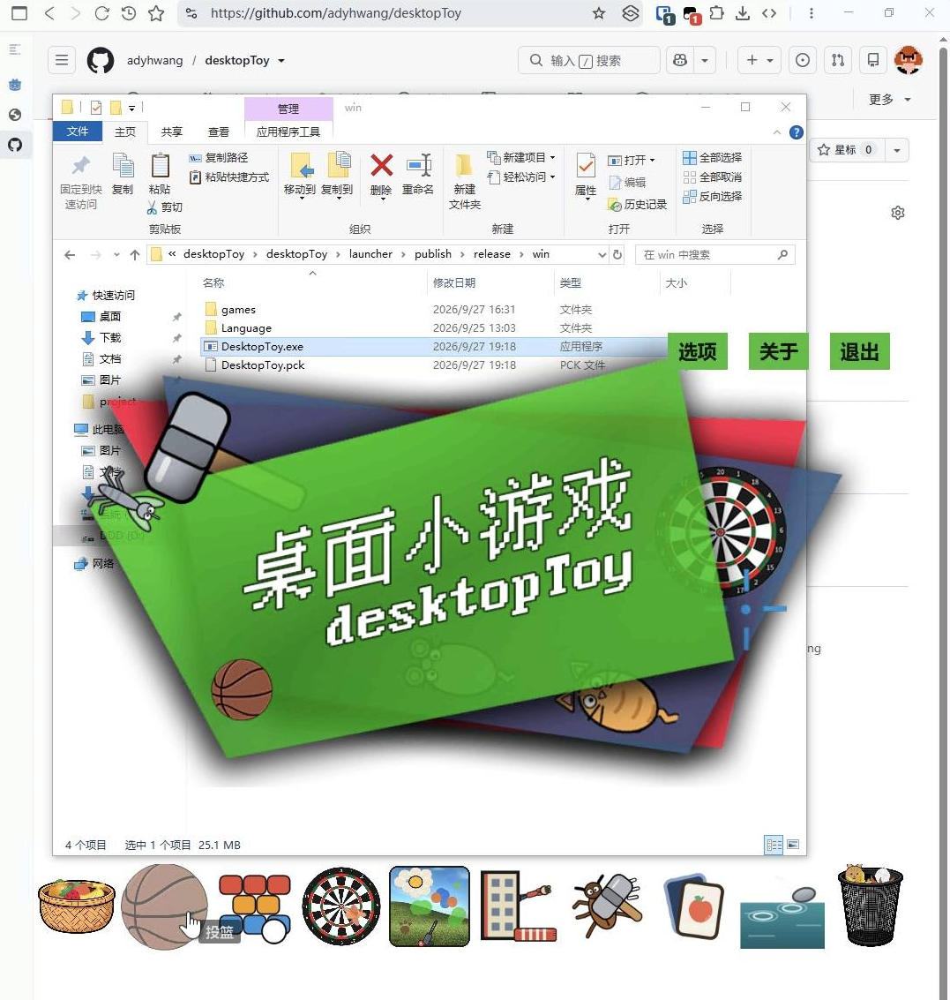
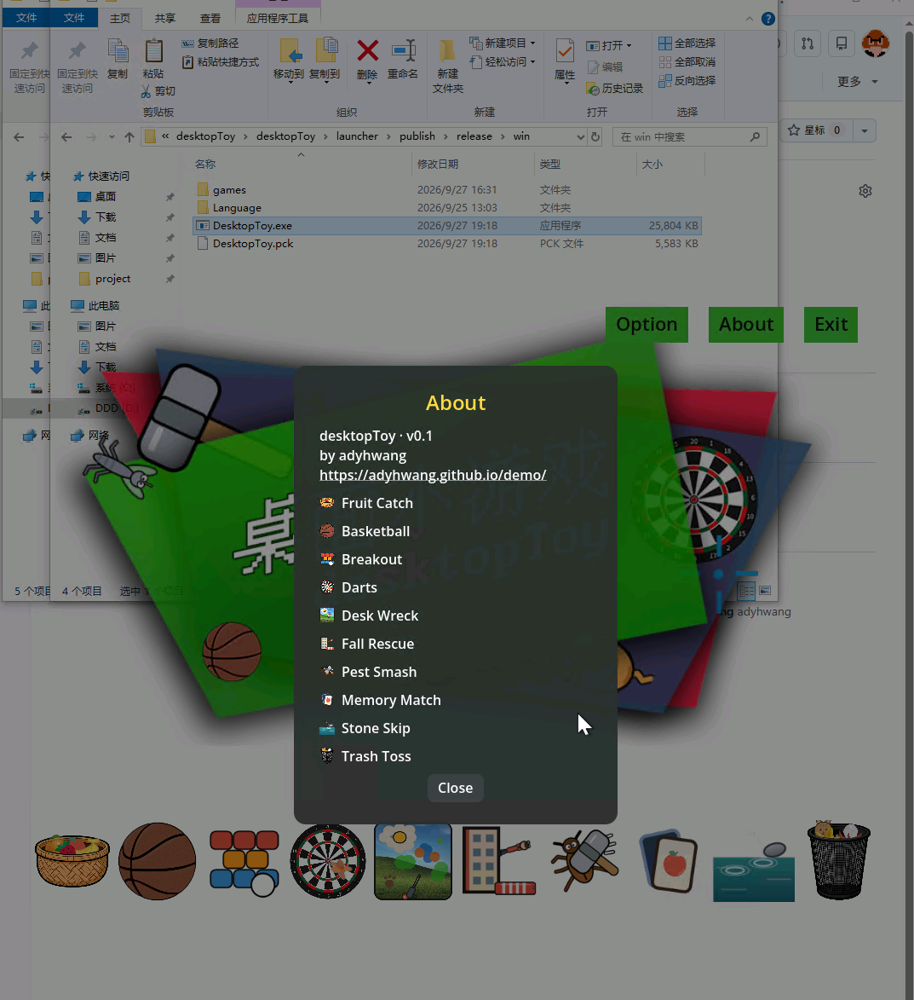

# 桌面小游戏 desktopToy

 

在线演示 Demo：[adyhwang.github.io/desktopToy/dt.html](https://adyhwang.github.io/desktopToy/dt.html)

一套直接"长"在桌面上的小游戏合集：启动后自动截取当前屏幕作为背景，游戏以透明浮层形式叠加在你正在使用的桌面上，不切换窗口、不打断工作，随手来一局。

A desktop toy games collection built with Godot 4.7. On startup it captures your current screen as the background, so games appear as a transparent overlay on your actual desktop — no window switching, no interruption. Play a quick round any time.

<p align="center"></p>

## ✨ 特性

- **真桌面融合**：启动时自动截屏作为背景（截屏失败时可用旁路 `wallpaper.png/jpg` 兜底），整个窗口看起来就是你原来的桌面，游戏浮在其上
- **13 款小游戏**：接水果、投篮、打砖块、飞镖、桌面破坏王、拯救跳楼的人、打害虫、记忆配对、打水漂、丢垃圾、弹弓打坏人、钓鱼、方块拼图
- **纯鼠标操作**：所有游戏只用鼠标，无键盘依赖
- **9 种界面语言**：简/繁中文、英、日、韩、法、德、西、俄
- **本地排行榜**：每款游戏独立记录前十名成绩
- **游戏包热插拔**：每个游戏是独立 `.pck`，启动器动态挂载 `games/` 目录，删掉 pck 即卸载游戏
- **UPX 压缩分发**：Windows 版 exe 从 104 MB 压至约 25 MB

### Features

- **True desktop blending**: captures the screen at startup (falls back to a side-car `wallpaper.png/jpg` when capture fails), so the window looks exactly like your original desktop with games floating on top
- **13 mini games**: Fruit Catch, Basketball, Breakout, Darts, Desk Wreck, Fall Rescue, Pest Smash, Memory Match, Stone Skip, Trash Toss, Slingshot, Fish Hook, Tetris Puzzle
- **Mouse only**: every game is designed for pure mouse control, no keyboard needed
- **9 UI languages**: zh_CN / zh_TW / en / ja / ko / fr / de / es / ru
- **Local leaderboard**: top-10 scores stored per game
- **Hot-pluggable game packs**: each game ships as a standalone `.pck` mounted dynamically from the `games/` folder — delete a pck to uninstall that game
- **UPX-compressed builds**: the Windows exe shrinks from 104 MB to ~25 MB

## 🎮 游戏一览 / Games

| 游戏 / Game | 玩法 / How to play |
|---|---|
| 🧺 接水果 Fruit Catch | 左右移动竹篮接住下落的水果，小心 rotten 烂果 |
| 🏀 投篮 Basketball | 按住拖拽投出篮球，把握力度与弧线入筐 |
| 🧱 打砖块 Breakout | 挡板反弹小球清空所有砖块，多种关卡布局 |
| 🎯 飞镖 Darts | 瞄准移动的准星掷出飞镖，射中靶心拿高分 |
| 🔨 桌面破坏王 Desk Wreck | 轮盘选择电锯、喷火器等工具尽情搞破坏解压 |
| 🏢 拯救跳楼的人 Fall Rescue | 移动救援气垫接住坠楼的人，弹跳高度逐次减半，救人闯关 |
| 🐀 打害虫 Pest Smash | 用锤子拍死到处乱爬的害虫，眼疾手快 |
| 🃏 记忆配对 Memory Match | 翻开卡片配对相同图案，考验记忆力 |
| ✊ 打水漂 Stone Skip | 选石头甩出去在水面打水漂，弹跳次数越多分越高 |
| 🗑️ 丢垃圾 Trash Toss | 把垃圾团纸团投进垃圾桶，注意风向与力度 |
| 🪃 弹弓打坏人 Slingshot | 轮盘选"子弹"（石头、鸡蛋、水气球……）拉弹弓打跑一波波来犯的劫匪，坚持更多波次 |
| 🎣 钓鱼 Fish Hook | 抛竿等待鱼咬钩，咬钩瞬间快速点击拔河收线；可投饵打窝吸引鱼群，钓齐更多鱼种 |
| 🧩 方块拼图 Tetris Puzzle | 拖动方块碎片旋转拼合，完全填满目标图形即过关；含经典方块与棱镜方块两种模式，无尽挑战 |

## 📸 截图 / Screenshots

| 打砖块 Breakout | 接水果 Fruit Catch |
|:---:|:---:|
|  |  |
| **拯救跳楼的人 Fall Rescue** | **桌面破坏王 Desk Wreck** |
|  |  |

<p align="center"></p>

## 📦 下载与运行 / Download & Run

到 publish\release 目录自行下载对应平台的最新版本，双击可执行文件即可，**无需安装、无任何依赖**。

Go to the `publish\release` directory to grab the latest build for your platform, then double-click the binary. No installation, no dependencies.

> 提示 Tip：程序目录下的 `games/*.pck` 是各游戏包，`Language/` 是启动器界面语言文件，均可自由增删。

### Linux 桌面快捷方式 / Linux desktop entry

在程序文件夹内执行 `install.sh`，会在**同目录**生成 `desktopToy.desktop`（关联可执行文件与本目录 `icon.png`，中文名"桌面小游戏"、英文名 desktopToy）；把它复制到 `~/.local/share/applications/` 即可出现在系统应用菜单。

Run `bash install.sh` inside the program folder: it generates `desktopToy.desktop` **in the same folder**, linking the binary and the local `icon.png` (Name: 桌面小游戏 / desktopToy). Copy it to `~/.local/share/applications/` to show up in your app menu.

```bash
bash install.sh
cp desktopToy.desktop ~/.local/share/applications/   # 可选 optional
```

### 添加新游戏 / Adding a game

在 `games_src/` 下新建目录（`project.godot` + `manifest.json` + `scenes/entry.tscn`…），运行 `rebuild_pcks.cmd` 即可——启动器扫描 `games/` 目录自动注册新游戏，无需改启动器代码。

Create a new folder under `games_src/` (`project.godot` + `manifest.json` + `scenes/entry.tscn` …) and run `rebuild_pcks.cmd` — the launcher scans `games/` and registers the new game automatically, no launcher code changes needed.

## 🧩 技术说明 / Technical Notes

- 启动器以 `keep` 标志启动游戏进程（pck 挂载进启动器进程运行，单实例、退出即回桌面）
- 每个游戏包内置 9 语言 json；启动器语言由 `Language/` 提供，界面语言跟随系统
- 素材以 C#（System.Drawing）程序化生成 + [OpenMoji](https://openmoji.org/) / icons8 免费图源，风格统一：扁平卡通、粗黑描边
- 截屏链：引擎 `screen_get_image` → 系统截屏工具（PowerShell/gnome-screenshot）→ 旁路壁纸文件，保证虚拟机等极端环境也有背景

## 🙏 致谢 / Credits

- 素材 Assets：[OpenMoji](https://openmoji.org/)（CC BY-SA 4.0）、[icons8](https://icons8.com/)
- 引擎 Engine：[Godot Engine](https://godotengine.org/) 4.7.2

---
如果这个项目对你有用，欢迎点个 Star ⭐
If you find this project fun, a star is appreciated ⭐
